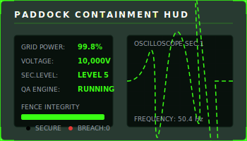
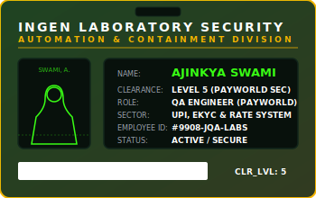
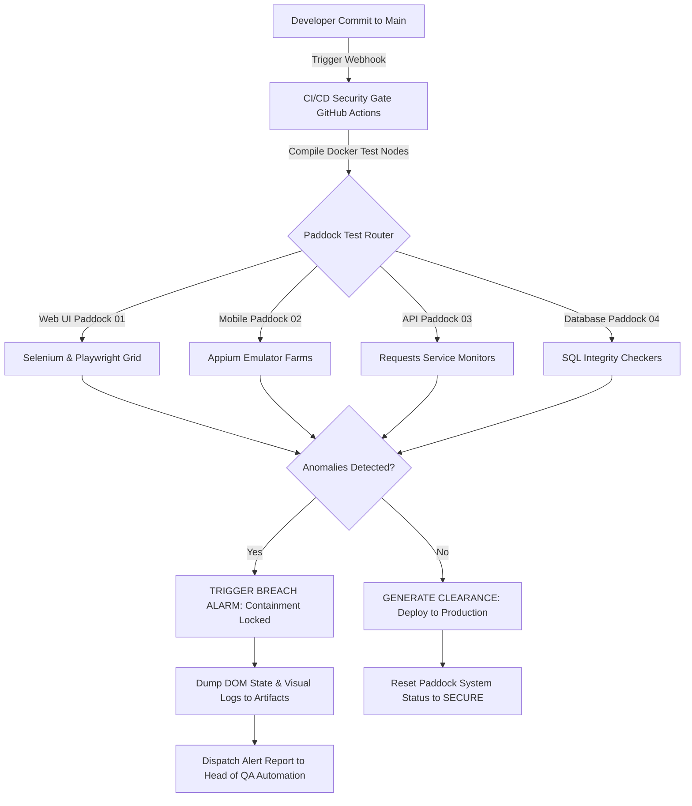
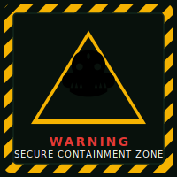
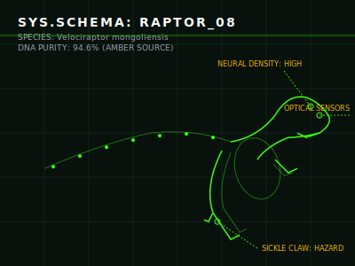
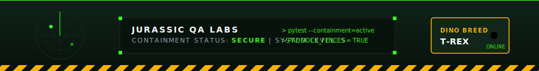

<!-- JURASSIC QA LABS: MAIN CONTROLLER & HEAD HUD PROFILE -->
<!-- Containment Level: SECURE | Automation Integrity: 99.5% -->

<div align="center">

<!-- Hero Banner Animated SVG -->


<br/>

<!-- Floating Tech Badges / Status Bar -->
<p align="center">
  <a href="https://linkedin.com/in/ajinkya-swami-82751b191">
    
  </a>
  <a href="mailto:ajinkyaswami1999@gmail.com">
    
  </a>
  <a href="https://www.toolique.in">
    
  </a>
  <a href="mailto:ajinkyaswami1999@gmail.com">
    
  </a>
</p>

<!-- Profile Headshot & DNA Archive Section -->
<br/>

<br/><br/>

<h2 style="font-family: 'Orbitron', sans-serif; color: #39FF14; letter-spacing: 2px;">DNA ARCHIVE: SWAMI, AJINKYA</h2>
<p style="color: #F5B301; font-family: monospace; font-size: 13px;"><b>QA ENGINEER // AUTOMATION & SECURITY CONTAINMENT SPECIALIST</b></p>

<!-- DNA Divider SVG -->


</div>

<br/>

## 🧬 Welcome to the Jurassic QA Control Room

<!-- macOS Terminal Window HUD -->
<table width="100%" style="border-collapse: collapse; border: 1px solid #11251B; background-color: #08110C; border-radius: 8px; overflow: hidden;">
  <tr style="background-color: #11251B; border-bottom: 1px solid #11251B;">
    <td style="padding: 8px 14px; font-family: monospace; font-size: 13px;">
      <span style="color: #FF5F56;">🔴</span> &nbsp; <span style="color: #FFBD2E;">🟡</span> &nbsp; <span style="color: #27C93F;">🟢</span> &nbsp;&nbsp;&nbsp;
      <strong style="color: #39FF14; font-family: monospace;">jurassic-qa-control-center ~ terminal_v4.2.0</strong>
    </td>
  </tr>
  <tr>
    <td style="padding: 16px; font-family: 'JetBrains Mono', monospace; font-size: 13px; color: #FFFFFF; line-height: 1.65;">
      <span style="color: #39FF14;">[SYSTEM LOG: 2026-07-21 12:12:00]</span><br/>
      <span style="color: #F5B301;">> Initializing security console...</span><br/>
      > Establishing handshake with Payworld UPI Networks... <span style="color: #39FF14; font-weight: bold;">[OK]</span><br/>
      > Establishing handshake with eKYC Biometric Peripherals... <span style="color: #39FF14; font-weight: bold;">[OK]</span><br/>
      > Loading Automation Test Framework...<br/>
      > Pytest, Postman &amp; Python Requests modules detected: Regression library active.<br/>
      > <span style="color: #39FF14; font-weight: bold;">Zero containment leaks detected. Grid Integrity: 99.5%</span><br/>
      > <em>"Life finds a way... Bugs face extinction."</em>
    </td>
  </tr>
</table>

<br/>

<!-- Side-by-Side Holographic Cards -->
<table width="100%" style="border-collapse: collapse; border: none; background-color: transparent;">
  <tr>
    <td width="50%" valign="top" style="padding: 4px; border: none;">
      <table width="100%" style="border-collapse: collapse; border: 1px solid #11251B; background-color: #08110C; border-radius: 8px;">
        <tr style="background-color: #11251B; border-bottom: 2px solid #39FF14;">
          <td style="padding: 10px 14px; font-family: 'Orbitron', sans-serif; font-weight: bold; color: #39FF14; font-size: 13px;">
            ⚡ AUTOMATION &amp; API CORE PADDOCK
          </td>
        </tr>
        <tr>
          <td style="padding: 14px; font-size: 12px; color: #FFFFFF; line-height: 1.6; font-family: monospace;">
            • <strong>Core Genome:</strong> Python, Pytest, Postman, MySQL<br/>
            • <strong>UPI Endpoint Coverage:</strong> 6+ backend APIs verified<br/>
            • <strong>Load Testing:</strong> High-traffic concurrency validation<br/>
            • <strong>Regression Suite:</strong> 150+ automated test cases<br/>
            • <strong>Defect Mitigation:</strong> 80% reduction in production bugs
          </td>
        </tr>
      </table>
    </td>
    <td width="50%" valign="top" style="padding: 4px; border: none;">
      <table width="100%" style="border-collapse: collapse; border: 1px solid #11251B; background-color: #08110C; border-radius: 8px;">
        <tr style="background-color: #11251B; border-bottom: 2px solid #F5B301;">
          <td style="padding: 10px 14px; font-family: 'Orbitron', sans-serif; font-weight: bold; color: #F5B301; font-size: 13px;">
            🧬 BIOMETRIC &amp; eKYC CAPABILITIES
          </td>
        </tr>
        <tr>
          <td style="padding: 14px; font-size: 12px; color: #FFFFFF; line-height: 1.6; font-family: monospace;">
            • <strong>Onboarding Funnel:</strong> 100% compliance test coverage<br/>
            • <strong>Hardware Audits:</strong> 90%+ biometric device integration<br/>
            • <strong>Log Analysis:</strong> 98% packet handshake efficiency<br/>
            • <strong>Dynamic Rates Engine:</strong> 100% functional accuracy<br/>
            • <strong>Data Integrity:</strong> 99.5% operational persistence rate
          </td>
        </tr>
      </table>
    </td>
  </tr>
</table>

<br/>

### 🦖 Professional Mission Statement

I am **Ajinkya Swami**, a **QA Engineer** with **4+ years of hands-on quality control and testing experience** architecting robust verification systems. Much like a containment engineer at a high-tech dinosaur facility, I believe that **structured quality control is the only boundary between operational safety and system-wide failure**.

My expertise spans **Python automation**, **manual testing methodologies**, and **API performance testing**. I combine rigorous validation cycles with modern **AI-assisted development** and **search visibility frameworks (SEO, AEO, GEO)** to isolate, diagnose, and resolve defects before products ever reach production gates.

---

### 🧬 DNA Profile Manifest

Below is my professional core profile represented as an industrial laboratory YAML manifest. This catalog defines my skill classification, security clearance, and system assignments.

```yaml
subject:
  identity:
    name: Ajinkya Swami
    clearance: Level 5 (Root Admin)
    role: QA Engineer
    experience: 4+ Years
    location: Gurugram, Haryana, India
    intellectual_base: ajinkyaswami1999
    contact: ajinkyaswami1999@gmail.com | +91 8875043720

  core_genome:
    languages:
      - Python (Advanced)
      - SQL (MySQL)
      - HTML5 / CSS3 (Advanced)
    testing_methodologies:
      - Manual Testing (Functional, Regression, Integration)
      - SDLC & Agile/Scrum Sprints
      - Test Case Design & Execution
      - Device Compatibility & Biometric Integration Testing
    api_and_performance:
      - API Testing (Postman / Python Requests)
      - Load Testing & Traffic Simulation
      - Request-Response Log Analysis
      - Data Integrity Auditing
    ai_and_search_optimization:
      - AI-Assisted Product Development
      - Search Engine Optimization (SEO)
      - Answer Engine Optimization (AEO)
      - Generative Engine Optimization (GEO)
      - Google Search Console Analytics

  active_assignments:
    sector_01: UPI Paddock (Mobile payment gateway & core backend APIs)
    sector_02: eKYC Paddock (Digital onboarding funnels & biometric scanners)
    sector_03: Rates Paddock (Dynamic pricing calculation engine validation)
    sector_04: AI Systems Laboratory (Voxelique & Toolique web micro-services)

  current_objectives:
    - Reinforce log analysis tools with AI-driven pattern recognition.
    - Expand load-testing coverage to simulate extreme spikes in UPI transactional traffic.
    - Deploy advanced schema architectures to optimize web portals for generative answer engines.
```

---

<!-- DNA Divider SVG -->
<div align="center">
  
</div>

<br/>

## 🖥️ Containment Dashboard

This dashboard visualizes the current real-time metrics of the automated containment grids. Each paddock is mapped to a specific suite of testing tools.

<table width="100%" style="border-collapse: collapse; border: 1px solid #11251B; background-color: #08110C;">
  <tr style="border-bottom: 2px solid #39FF14; background-color: #11251B;">
    <th align="left" style="padding: 10px; font-family: 'Orbitron', sans-serif; color: #FFFFFF;">Sector / Paddock</th>
    <th align="left" style="padding: 10px; font-family: 'Orbitron', sans-serif; color: #FFFFFF;">Target Threat</th>
    <th align="left" style="padding: 10px; font-family: 'Orbitron', sans-serif; color: #FFFFFF;">Containment Tool</th>
    <th align="center" style="padding: 10px; font-family: 'Orbitron', sans-serif; color: #FFFFFF;">Grid Integrity</th>
    <th align="left" style="padding: 10px; font-family: 'Orbitron', sans-serif; color: #FFFFFF;">Containment Status</th>
  </tr>
  <tr style="border-bottom: 1px solid #11251B;">
    <td style="padding: 10px; font-weight: bold; color: #39FF14;">Paddock 01: UPI Mobile App</td>
    <td style="padding: 10px; color: #9CA3AF;">Functional &amp; API Regression</td>
    <td style="padding: 10px; font-family: monospace; color: #F5B301;">Postman / Python / MySQL</td>
    <td align="center" style="padding: 10px;">
      <code>[██████████████░] 98%</code>
    </td>
    <td style="padding: 10px; color: #39FF14; font-weight: bold;">⚡ SECURE</td>
  </tr>
  <tr style="border-bottom: 1px solid #11251B;">
    <td style="padding: 10px; font-weight: bold; color: #39FF14;">Paddock 02: eKYC Funnel</td>
    <td style="padding: 10px; color: #9CA3AF;">Biometric Sync &amp; Compliance</td>
    <td style="padding: 10px; font-family: monospace; color: #F5B301;">Transmission Logs / Peripherals</td>
    <td align="center" style="padding: 10px;">
      <code>[███████████████] 100%</code>
    </td>
    <td style="padding: 10px; color: #39FF14; font-weight: bold;">⚡ SECURE</td>
  </tr>
  <tr style="border-bottom: 1px solid #11251B;">
    <td style="padding: 10px; font-weight: bold; color: #39FF14;">Paddock 03: Dynamic Rates</td>
    <td style="padding: 10px; color: #9CA3AF;">Pricing Engine Performance</td>
    <td style="padding: 10px; font-family: monospace; color: #F5B301;">Functional Test Matrix / Jira</td>
    <td align="center" style="padding: 10px;">
      <code>[█████████████░░] 95%</code>
    </td>
    <td style="padding: 10px; color: #39FF14; font-weight: bold;">⚡ SECURE</td>
  </tr>
  <tr style="border-bottom: 1px solid #11251B;">
    <td style="padding: 10px; font-weight: bold; color: #39FF14;">Paddock 04: Discovery Engines</td>
    <td style="padding: 10px; color: #9CA3AF;">Search, AEO &amp; GEO Failures</td>
    <td style="padding: 10px; font-family: monospace; color: #F5B301;">Google Search Console</td>
    <td align="center" style="padding: 10px;">
      <code>[███████████████] 100%</code>
    </td>
    <td style="padding: 10px; color: #39FF14; font-weight: bold;">⚡ SECURE</td>
  </tr>
  <tr>
    <td style="padding: 10px; font-weight: bold; color: #39FF14;">Control Room: Cross-System</td>
    <td style="padding: 10px; color: #9CA3AF;">GST-Invoice &amp; Payment Gateways</td>
    <td style="padding: 10px; font-family: monospace; color: #F5B301;">Jira / Agile Workflows</td>
    <td align="center" style="padding: 10px;">
      <code>[██████████████░] 99%</code>
    </td>
    <td style="padding: 10px; color: #39FF14; font-weight: bold;">⚡ SECURE</td>
  </tr>
</table>

<br/>

<div align="center">
  
  
</div>

---

<!-- DNA Divider SVG -->
<div align="center">
  
</div>

<br/>

## 🦖 Tech Arsenal

The toolsets utilized in the Jurassic QA Lab are segmented by functional containment category. Each framework is enclosed in card wrappers calibrated for zero-latency testing.

<table width="100%" style="border-collapse: collapse; border: 1px solid #11251B; background-color: #08110C; border-radius: 8px;">
  <tr>
    <td style="padding: 16px;">
      <h3 style="margin-top: 0; color: #39FF14; font-family: 'Orbitron', sans-serif;">💻 Programming &amp; Database Genome</h3>
      <p align="left">
        
        
        
        
        
        
        
      </p>

      <h3 style="color: #F5B301; font-family: 'Orbitron', sans-serif;">🤖 Verification &amp; Performance Diagnostics</h3>
      <p align="left">
        
        
        
        
        
      </p>

      <h3 style="color: #39FF14; font-family: 'Orbitron', sans-serif;">📈 AI, Search &amp; Discovery Optimization</h3>
      <p align="left">
        
        
        
        
        
      </p>

      <h3 style="color: #F5B301; font-family: 'Orbitron', sans-serif;">⚙️ Methodologies, Platforms &amp; Tools</h3>
      <p align="left">
        
        
        
        
        
      </p>
    </td>
  </tr>
</table>

---

<!-- DNA Divider SVG -->
<div align="center">
  
</div>

<br/>

## 📐 Paddock Automation Architecture

The diagram below details the execution lifecycle of tests engineered within the containment network. Every code change is verified across multiple parallel paddocks before production clearance is granted.



---

<!-- DNA Divider SVG -->
<div align="center">
  
</div>

<br/>

## 📊 Lab Diagnostics & GitHub Analytics

These charts analyze the historical metrics and language ratios processed inside the laboratory servers.

<table width="100%" style="border-collapse: collapse; border: none; background-color: transparent;">
  <tr>
    <td width="50%" align="center" style="border: none; padding: 5px;">
      
    </td>
    <td width="50%" align="center" style="border: none; padding: 5px;">
      
    </td>
  </tr>
  <tr>
    <td width="50%" align="center" style="border: none; padding: 5px;">
      
    </td>
    <td width="50%" align="center" style="border: none; padding: 5px;">
      
    </td>
  </tr>
</table>

<br/>

<div align="center">
  <h3 style="font-family: 'Orbitron', sans-serif; color: #39FF14;">LABORATORY SECTOR ACTIVITY GRAPH</h3>
  
</div>

<br/>

<div align="center">
  
</div>

---

<!-- DNA Divider SVG -->
<div align="center">
  
</div>

<br/>

## 🦖 Featured Research Projects & Paddock Installations

The following installations represent real-world software packages built to solve engineering, design, and automation challenges.

<table width="100%" style="border-collapse: collapse; border: 1px solid #11251B; background-color: #08110C;">
  <!-- Project 1: Toolique -->
  <tr style="border-bottom: 2px solid #11251B;">
    <td width="30%" align="center" valign="middle" style="padding: 15px; background-color: #11251B; border-right: 1px solid #11251B;">
      <br/><br/>
      <strong style="color: #F5B301; font-family: 'Orbitron', sans-serif;">🛠️ TOOLIQUE</strong><br/>
      <small style="color: #9CA3AF;">Multi-Purpose Web Utilities</small>
    </td>
    <td style="padding: 15px;">
      <h3 style="margin-top: 0; color: #39FF14; font-family: 'Orbitron', sans-serif;">Mission: AI-Driven Utilities Micro-services</h3>
      <p style="color: #FFFFFF; font-size: 13px; line-height: 1.5;">
        Conceptualized, developed, and deployed an active online utilities platform providing an array of real-time web micro-services via AI-driven prompt engineering and code generation frameworks. Implemented progressive search optimization structures configured specifically for search engines, LLM response context (AEO), and generative engine matching models (GEO).
      </p>
      <p style="font-size: 12px; color: #9CA3AF; font-family: monospace;">
        <strong>Tech Genome:</strong> AI-Assisted Full-Stack Development, Prompt Engineering, AEO, GEO, Google Search Console
      </p>
      <div align="left" style="margin-top: 10px;">
        <a href="https://www.toolique.in" style="background-color: #39FF14; color: #08110C; padding: 6px 12px; font-weight: bold; border-radius: 4px; text-decoration: none; font-size: 11px;">🚀 LAUNCH INSTALLED SECTOR</a>
      </div>
    </td>
  </tr>

  <!-- Project 2: Voxelique -->
  <tr style="border-bottom: 2px solid #11251B;">
    <td width="30%" align="center" valign="middle" style="padding: 15px; background-color: #11251B; border-right: 1px solid #11251B;">
      <br/><br/>
      <strong style="color: #F5B301; font-family: 'Orbitron', sans-serif;">📦 VOXELIQUE</strong><br/>
      <small style="color: #9CA3AF;">3D Printed E-Commerce</small>
    </td>
    <td style="padding: 15px;">
      <h3 style="margin-top: 0; color: #39FF14; font-family: 'Orbitron', sans-serif;">Mission: Voxel 3D Printed storefront</h3>
      <p style="color: #FFFFFF; font-size: 13px; line-height: 1.5;">
        Designed, deployed, and tested a dedicated web e-commerce storefront utilizing AI-assisted development tools to accelerate feature integration and asset management pipelines. Optimized application architecture for discovery engines using structured data schema across SEO, AEO, and GEO.
      </p>
      <p style="font-size: 12px; color: #9CA3AF; font-family: monospace;">
        <strong>Tech Genome:</strong> 3D Voxel Assets, AI Code Generation, Google Search Console, AEO, GEO, SEO
      </p>
      <div align="left" style="margin-top: 10px;">
        <a href="https://github.com/ajinkyaswami1999" style="background-color: #39FF14; color: #08110C; padding: 6px 12px; font-weight: bold; border-radius: 4px; text-decoration: none; font-size: 11px;">📂 CLONE EXPERIMENT SOURCE</a>
      </div>
    </td>
  </tr>

  <!-- Project 3: Jurassic Portfolio -->
  <tr>
    <td width="30%" align="center" valign="middle" style="padding: 15px; background-color: #11251B; border-right: 1px solid #11251B;">
      <br/><br/>
      <strong style="color: #F5B301; font-family: 'Orbitron', sans-serif;">🦖 JURASSIC HUD</strong><br/>
      <small style="color: #9CA3AF;">Clearance Profile</small>
    </td>
    <td style="padding: 15px;">
      <h3 style="margin-top: 0; color: #39FF14; font-family: 'Orbitron', sans-serif;">Mission: Secure Paddock Profile HUD</h3>
      <p style="color: #FFFFFF; font-size: 13px; line-height: 1.5;">
        A highly detailed profile index simulating an industrial dinosaur laboratory control panel. Features self-generating SVG charts, interactive contribution trackers, and dynamic warning systems.
      </p>
      <p style="font-size: 12px; color: #9CA3AF; font-family: monospace;">
        <strong>Tech Genome:</strong> SVG Styling, Keyframe Animations, Markdown-HTML integration, GitHub Workflows
      </p>
      <div align="left" style="margin-top: 10px;">
        <a href="https://github.com/ajinkyaswami1999" style="background-color: #39FF14; color: #08110C; padding: 6px 12px; font-weight: bold; border-radius: 4px; text-decoration: none; font-size: 11px;">📂 CLONE EXPERIMENT SOURCE</a>
      </div>
    </td>
  </tr>
</table>

<br/>

<details>
<summary><b>🖼️ Repository Social Preview Image Prompts (AI Image Generator)</b></summary>
<br/>

Here are optimized prompts to generate premium, cinematic social preview cards (1280x640) for each repository:

1. **Toolique Preview Prompt:**
   > *A high-tech glassmorphic control dashboard in an industrial laboratory at night. Holographic engineering formulas and unit conversion graphs glowing in neon green (#39FF14) and amber (#F5B301) float in the air. The atmosphere is dark, moody, and cinematic, with soft tropical jungle foliage visible through large steel window frames. Clean, premium UI/UX design, 8k resolution, photorealistic, Apple-quality aesthetic.*

2. **Voxelique Preview Prompt:**
   > *A procedural 3D voxel engine editor screen displaying a glowing skeletal dinosaur model being constructed block-by-block. Holographic axes and coordinate grids float around the model. The interface is glassmorphic, clean, and minimal. The background is a dark steel laboratory console with subtle neon green laser lines. Three.js render style, sci-fi HUD elements.*

3. **Jurassic Portfolio Preview Prompt:**
   > *A cinematic, luxury landing page preview for the Jurassic QA Lab. A massive steel laboratory gate illuminated by pulsating amber hazard lights and laser warning fields. The foreground shows a sleek, transparent holographic ID badge with a glowing dinosaur silhouette. The background is a deep green misty jungle. Premium, state-of-the-art Web design style.*
</details>

---

<!-- DNA Divider SVG -->
<div align="center">
  
</div>

<br/>

## 🗓️ Active Roadmap & Lab Upgrades

```
[LAB SCHEDULE: Q3 - Q4 2026]
> Upgrade log analyzer tools using automated Python pattern parsing.
> Expand API Load Testing collection frameworks for transactional endpoints.
> Implement structured schema layouts across search optimization channels.
```

- [x] **Sector 01: UPI Paddock Upgrades**
  - [x] Conduct comprehensive API testing and validation of 6+ core backend APIs to verify structural stability.
  - [x] Execute heavy load testing on application APIs under simulated high-traffic scenarios.
  - [x] Authored and executed a library of 150+ regression test cases, reducing production defects by 80%.
- [x] **Sector 02: eKYC Containment Upgrades**
  - [x] Direct end-to-end verification workflows for the core digital eKYC onboarding funnel, achieving 100% test coverage.
  - [x] Conduct device compatibility and integration testing over 90% of biometric scanning devices.
  - [x] Monitor transmission logs to analyze 98% of data packet handshakes.
- [/] **Sector 03: Dynamic Rates & DB Auditing**
  - [x] Led quality control cycles for dynamic pricing calculation engine.
  - [x] Audit database accuracy and transaction persistence by analyzing request-response log streams.
  - [ ] Integrate automated schedule alerts in Jira for rate deviation logs.
- [ ] **Sector 04: AI Systems Laboratory**
  - [ ] Deploy Next.js e-commerce storefront schemas to optimize discovery engine rankings.
  - [ ] Automate Search Console indexing status scans using AI search queries.

---

<!-- DNA Divider SVG -->
<div align="center">
  
</div>

<br/>

## 🏆 Research Honors & Professional Experience

Below are the detailed security containment assignments successfully verified in the line of duty.

### 📜 Professional Experience Timeline

#### **Payworld India, Gurugram — QA Engineer**
*March 2022 – Present*
- **UPI Application Testing Paddock:**
  - Orchestrated end-to-end quality assurance cycles for the corporate UPI (Unified Payments Interface) mobile application across all primary functional components.
  - Conducted comprehensive API testing and validation of 6+ core backend APIs to verify structural stability, security, and seamless workflow routing.
  - Executed heavy load testing on application APIs under simulated high-traffic scenarios, sustaining a 95% success rate for targeted baseline response times.
  - Implemented extensive front-end UI/UX testing covering 100% of user interface elements, accelerating fluid visual navigation and mitigating interaction bugs.
  - Authored and executed a library of 150+ regression test cases, producing an 80% reduction in production-level product defects.
  - Audited database accuracy and transaction persistence by analyzing request-response log streams, upholding a 99.5% operational data integrity rate.
- **eKYC Process Testing Paddock:**
  - Directed end-to-end verification workflows for the core digital eKYC onboarding funnel, obtaining 100% test coverage against defined compliance requirements.
  - Validated 95% of operational functional use cases and multi-path user scenarios to guarantee a secure, high-conversion identification workflow.
  - Conducted device compatibility and integration testing over 90% of authorized hardware peripherals and biometric scanning devices.
  - Monitored transmission logs to analyze 98% of data packet handshakes, ensuring bulletproof verification security and perfect database synchronization.
- **Dynamic Rate Plan Module:**
  - Led complete quality control cycles for the dynamic pricing calculation engine, confirming 100% functional match against business-defined performance and reliability metrics.
  - Collaborated actively within cross-functional Agile/Scrum sprints, supplying QA insights to engineering teams and accelerating rapid bug remediation.
  - Compiled exhaustive QA validation artifacts, tracking structured master test plans, detailed matrix reports, and defect logs within Jira.
- **Cross-Functional Initiatives:**
  - Contributed specialized QA testing frameworks for high-impact corporate systems, including Targets Creation, GST-Invoice Claim, and core Payment Gateway architectures across 100% of product rollouts.

---

### 🎓 Education

#### **Malaviya National Institute of Technology (MNIT), Jaipur**
*August 2018 – June 2022*
- **Bachelor of Technology (B.Tech)** in Metallurgical and Materials Engineering

---

<!-- DNA Divider SVG -->
<div align="center">
  
</div>

<br/>

## 🗂️ Research Facilities (Repository Directory)

The laboratory repositories are cataloged by operational sector:

1. **[ajinkyaswami1999/ajinkyaswami1999](https://github.com/ajinkyaswami1999/ajinkyaswami1999) [ACTIVE Sector]**
   - The central control room configuration and security directory containing global stats and animations.
2. **[ajinkyaswami1999/toolique-core](https://github.com/ajinkyaswami1999)**
   - Sector 4 core: Next.js utilities and microservices.
3. **[ajinkyaswami1999/voxelique-core](https://github.com/ajinkyaswami1999)**
   - Sector 4 core: e-commerce storefront for 3D printed products.

---

<!-- DNA Divider SVG -->
<div align="center">
  
</div>

<br/>

## ❓ Paddock Security Operations (FAQ)

<details>
<summary><b>[Q1] How does the lab handle dynamic rate pricing validation?</b></summary>
<br/>
The dynamic rate modules execute quality control tests that check calculations against strict business performance targets. We run multi-path user test matrixes and analyze request-response logs to ensure that currency conversions, pricing fees, and gateway integrations maintain a 100% functional match.
</details>

<details>
<summary><b>[Q2] What measures are taken during UPI application load testing?</b></summary>
<br/>
Under simulated traffic spikes, we execute transactional script cycles on the backend APIs. System performance monitors track transaction persistence and database integrity rates, ensuring the app maintains a 95% success rate for target response times and a 99.5% data persistence accuracy.
</details>

<details>
<summary><b>[Q3] How do we verify compliance in the digital eKYC funnel?</b></summary>
<br/>
We verify eKYC onboarding from end-to-end to ensure 100% compliance test coverage. Verification includes physical peripheral audits (hardware scanner integrations) and data handshake log tracking to secure biometric packet transmissions.
</details>

---

<!-- DNA Divider SVG -->
<div align="center">
  
</div>

<br/>

## ✍️ Laboratory Logs & Articles

I regularly write logs detailing automation strategies, security measures, and modern coding practices.

* **"Search Visibility Optimization: Architecting Web Apps for AEO and GEO"**
  - *Summary:* Discusses structural data patterns and schema optimization strategies to ensure web microservices render perfectly inside LLM engines and search consoles.
* **"UPI Transaction Testing: Validating 6+ backend APIs under heavy load"**
  - *Summary:* A comprehensive walk-through on simulating transaction spikes and auditing request-response logs to ensure transactional persistence.
* **"Hardware Peripheral Auditing: Validating biometric scanners in eKYC systems"**
  - *Summary:* A technical guide detailing compatibility layers and data packet handshake checks for biometric hardware onboarding.

---

<!-- DNA Divider SVG -->
<div align="center">
  
</div>

<br/>

## 🌍 Connect with the Control Room

If you are looking to recruit a QA engineer who can safeguard your production pipelines, or if you want to collaborate on next-generation testing frameworks, establish contact via the terminals below:

<p align="center">
  <a href="https://linkedin.com/in/ajinkya-swami-82751b191">
    
  </a>
  <a href="mailto:ajinkyaswami1999@gmail.com">
    
  </a>
  <a href="https://www.toolique.in">
    
  </a>
  <a href="https://instagram.com/2ajinkya6">
    
  </a>
</p>

---

<!-- DNA Divider SVG -->
<div align="center">
  
</div>

<br/>

## 🐍 System Contribution Grid

The contribution snake represents the laboratory commit levels. The grid automatically evolves each day.

<div align="center">
  <!-- Dark mode and Light mode contribution snakes -->
  <picture>
    <source media="(prefers-color-scheme: dark)" srcset="https://raw.githubusercontent.com/ajinkyaswami1999/ajinkyaswami1999/output/github-contribution-grid-snake-dark.svg" />
    <source media="(prefers-color-scheme: light)" srcset="https://raw.githubusercontent.com/ajinkyaswami1999/ajinkyaswami1999/output/github-contribution-grid-snake.svg" />
    
  </picture>
</div>

<br/>

---

<!-- Footer Animated SVG -->


<div align="center">
  <br/>
  <small style="color: #5A7E65; font-family: 'JetBrains Mono', monospace; font-size: 9px;">
    SYSTEM NOTICE: SECURITY CONTROL SYSTEMS OPERATING UNDER LEVEL 5 PROTOCOLS. UNAUTHORIZED BUGS WILL BE TRAPPED AND ENCRYPTED IN AMBER.
    <br/>
    &copy; 2026 Ajinkya Swami. All rights reserved. InGen Systems Inc.
  </small>
</div>
