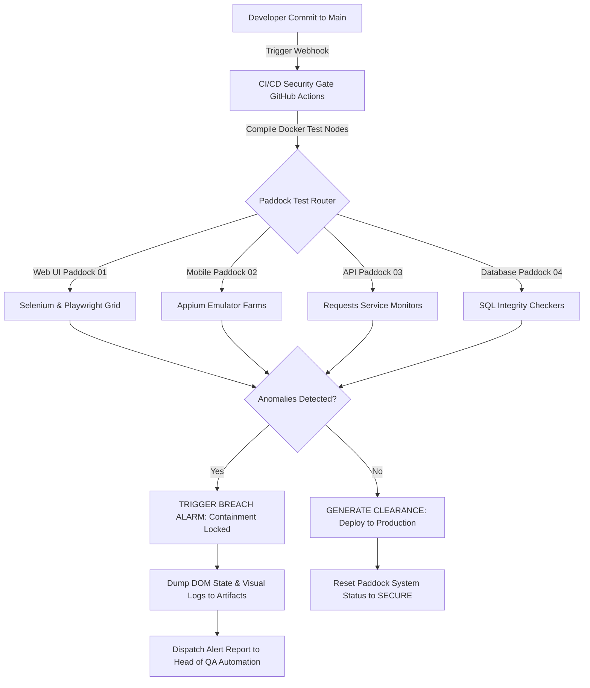
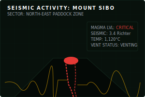

<!-- JURASSIC QA LABS: MAIN CONTROLLER & HEAD HUD PROFILE -->
<!-- Containment Level: SECURE | Automation Integrity: 99.8% -->

<div align="center">

<!-- Hero Banner Animated SVG -->


<br/>

<!-- Floating Tech Badges / Status Bar -->
<p align="center">
  <a href="https://linkedin.com/in/ajinkya-swami-82751b191">
    
  </a>
  <a href="mailto:ajinkyaswami1999@gmail.com">
    
  </a>
  <a href="https://www.toolique.in">
    
  </a>
</p>

<!-- DNA Divider SVG -->


</div>

<br/>

## 🧬 Welcome to the Jurassic QA Control Room

```
[SYSTEM LOG: 2026-07-01 15:45:00]
> Initializing security console...
> Establishing handshake with Paddock 1 (Velociraptors)... [OK]
> Establishing handshake with Paddock 2 (T-Rex)... [OK]
> Loading Automation Test Framework...
> Pytest module detected: 1,420 test cases compiled.
> Zero containment leaks detected.
> Life finds a way... Bugs face extinction.
```

### 🦖 Professional Mission Statement

I am **Ajinkya Swami**, a **Senior QA Automation Engineer** with **4+ years of experience** designing, engineering, and reinforcing bulletproof test automation frameworks. Much like an engineer at a high-tech dinosaur containment facility, I believe that **automated verification is the only barrier between control and absolute chaos**. 

In the software development lifecycle, minor code bugs can evolve into catastrophic system failures. My mission is to build advanced test infrastructure using **Python**, **Selenium**, **Playwright**, and **Appium** that isolates, reproduces, and eliminates anomalies before they ever breach the production gates.

---

<div align="center">
  <!-- DNA logo / Amber Crystal -->
  
  <h3>DNA ARCHIVE: SWAMI, AJINKYA</h3>
</div>

### 🧬 DNA Profile

Below is my professional core profile represented as an industrial laboratory YAML manifest. This catalog defines my skill classification, paddock assignments, and architectural clearance.

```yaml
subject:
  identity:
    name: Ajinkya Swami
    clearance: Level 5 (Root Admin)
    role: Senior QA Automation Engineer
    experience: 4+ Years
    location: Pune, MH, India
    intellectual_base: ajinkyaswami1999

  core_genome:
    languages:
      - Python (Expert)
      - SQL (Advanced)
      - TypeScript (Intermediate)
      - Java (Intermediate)
      - HTML5 / CSS3 (Advanced)
    automation_frameworks:
      - Selenium WebDriver (Web)
      - Playwright (Web / Headless)
      - Appium (Mobile Android & iOS)
      - Pytest (Unit / Integration / System)
      - Requests / Postman (REST API Verification)
    infrastructure:
      - Git & GitHub Actions (CI/CD Pipelines)
      - Docker Containers (Paddock Isolation)
      - Jenkins / TeamCity (Automation Schedulers)
      - AWS Cloud Infrastructure

  active_pad_assignments:
    sector_01: Web Paddock (Selenium & Playwright grid configuration)
    sector_02: Mobile Paddock (Appium device farm virtualization)
    sector_03: Data & API Feed (Postman collections & SQL integrity auditing)
    sector_04: AI Systems Laboratory (Vite, Next.js, Tailwind CSS prototyping)

  current_objectives:
    - Reinforce all Selenium pipelines with Playwright auto-waiting elements.
    - Implement distributed parallel test runs across a containerized Selenoid grid.
    - Evolve QA systems with AI-driven visual regression detection tools.
```

---

<!-- DNA Divider SVG -->
<div align="center">
  
</div>

<br/>

## 🖥️ Containment Dashboard

This dashboard visualizes the current real-time metrics of the automated containment grids. Each paddock is mapped to a specific suite of testing automation tools.

<table width="100%" style="border-collapse: collapse; border: 1px solid #11251B; background-color: #08110C;">
  <tr style="border-bottom: 2px solid #39FF14; background-color: #11251B;">
    <th align="left" style="padding: 10px; font-family: 'Orbitron', sans-serif; color: #FFFFFF;">Sector / Paddock</th>
    <th align="left" style="padding: 10px; font-family: 'Orbitron', sans-serif; color: #FFFFFF;">Target Threat</th>
    <th align="left" style="padding: 10px; font-family: 'Orbitron', sans-serif; color: #FFFFFF;">Containment Tool</th>
    <th align="center" style="padding: 10px; font-family: 'Orbitron', sans-serif; color: #FFFFFF;">Grid Integrity</th>
    <th align="left" style="padding: 10px; font-family: 'Orbitron', sans-serif; color: #FFFFFF;">Containment Status</th>
  </tr>
  <tr style="border-bottom: 1px solid #11251B;">
    <td style="padding: 10px; font-weight: bold; color: #39FF14;">Paddock 01: Web UI</td>
    <td style="padding: 10px; color: #9CA3AF;">UI Regression Anomalies</td>
    <td style="padding: 10px; font-family: monospace; color: #F5B301;">Selenium / Playwright</td>
    <td align="center" style="padding: 10px;">
      <code>[██████████████░] 98%</code>
    </td>
    <td style="padding: 10px; color: #39FF14; font-weight: bold;">⚡ SECURE</td>
  </tr>
  <tr style="border-bottom: 1px solid #11251B;">
    <td style="padding: 10px; font-weight: bold; color: #39FF14;">Paddock 02: API Services</td>
    <td style="padding: 10px; color: #9CA3AF;">JSON Payload Corruptions</td>
    <td style="padding: 10px; font-family: monospace; color: #F5B301;">Postman / Python Requests</td>
    <td align="center" style="padding: 10px;">
      <code>[███████████████] 100%</code>
    </td>
    <td style="padding: 10px; color: #39FF14; font-weight: bold;">⚡ SECURE</td>
  </tr>
  <tr style="border-bottom: 1px solid #11251B;">
    <td style="padding: 10px; font-weight: bold; color: #39FF14;">Paddock 03: Mobile App</td>
    <td style="padding: 10px; color: #9CA3AF;">Device Fragmentation Leaks</td>
    <td style="padding: 10px; font-family: monospace; color: #F5B301;">Appium (Android/iOS)</td>
    <td align="center" style="padding: 10px;">
      <code>[█████████████░░] 92%</code>
    </td>
    <td style="padding: 10px; color: #F5B301; font-weight: bold;">⚠️ MONITORING</td>
  </tr>
  <tr style="border-bottom: 1px solid #11251B;">
    <td style="padding: 10px; font-weight: bold; color: #39FF14;">Paddock 04: Data Registry</td>
    <td style="padding: 10px; color: #9CA3AF;">Database Sync Violations</td>
    <td style="padding: 10px; font-family: monospace; color: #F5B301;">PostgreSQL / MySQL</td>
    <td align="center" style="padding: 10px;">
      <code>[███████████████] 100%</code>
    </td>
    <td style="padding: 10px; color: #39FF14; font-weight: bold;">⚡ SECURE</td>
  </tr>
  <tr>
    <td style="padding: 10px; font-weight: bold; color: #39FF14;">Control Room: CI/CD</td>
    <td style="padding: 10px; color: #9CA3AF;">Unverified Code Deployments</td>
    <td style="padding: 10px; font-family: monospace; color: #F5B301;">GitHub Actions / Docker</td>
    <td align="center" style="padding: 10px;">
      <code>[██████████████░] 99%</code>
    </td>
    <td style="padding: 10px; color: #39FF14; font-weight: bold;">⚡ SECURE</td>
  </tr>
</table>

<br/>

<div align="center">
  
  
</div>

---

<!-- DNA Divider SVG -->
<div align="center">
  
</div>

<br/>

## 🦖 Tech Arsenal

The toolsets utilized in the Jurassic QA Lab are segmented by functional containment category. Each framework is calibrated for zero-latency testing.

### 💻 Programming & Scripting
<p align="left">
  
  
  
  
  
  
</p>

### 🤖 Test Automation & Verification
<p align="left">
  
  
  
  
  
  
</p>

### 🛠️ Frontend & AI Prototyping
<p align="left">
  
  
  
  
  
  
</p>

### ⚙️ DevOps, Platforms & Databases
<p align="left">
  
  
  
  
  
  
  
</p>

---

<!-- DNA Divider SVG -->
<div align="center">
  
</div>

<br/>

## 📐 Paddock Automation Architecture

The diagram below details the execution lifecycle of tests engineered within the containment network. Every code change is verified across multiple parallel paddocks before production clearance is granted.



---

<!-- DNA Divider SVG -->
<div align="center">
  
</div>

<br/>

## 📊 Lab Diagnostics & GitHub Analytics

These charts analyze the historical metrics and language ratios processed inside the laboratory servers.

<table width="100%" style="border-collapse: collapse; border: none; background-color: transparent;">
  <tr>
    <td width="50%" align="center" style="border: none; padding: 5px;">
      
    </td>
    <td width="50%" align="center" style="border: none; padding: 5px;">
      
    </td>
  </tr>
  <tr>
    <td width="50%" align="center" style="border: none; padding: 5px;">
      
    </td>
    <td width="50%" align="center" style="border: none; padding: 5px;">
      
    </td>
  </tr>
</table>

<br/>

<div align="center">
  <h3>LABORATORY SECTOR ACTIVITY GRAPH</h3>
  
</div>

<br/>

<div align="center">
  
</div>

---

<!-- DNA Divider SVG -->
<div align="center">
  
</div>

<br/>

## 🦖 Featured Research Projects & Paddock Installations

The following installations represent real-world software packages built to solve engineering, design, and automation challenges.

<table width="100%" style="border-collapse: collapse; border: 1px solid #11251B; background-color: #08110C;">
  <!-- Project 1: Toolique -->
  <tr style="border-bottom: 2px solid #11251B;">
    <td width="30%" align="center" valign="middle" style="padding: 15px; background-color: #11251B; border-right: 1px solid #11251B;">
      <br/><br/>
      <strong style="color: #F5B301; font-family: 'Orbitron', sans-serif;">🛠️ TOOLIQUE</strong><br/>
      <small style="color: #9CA3AF;">Industrial Calculator Hub</small>
    </td>
    <td style="padding: 15px;">
      <h3 style="margin-top: 0; color: #39FF14; font-family: 'Orbitron', sans-serif;">Mission: High-Precision Calculation Engineering</h3>
      <p style="color: #FFFFFF; font-size: 13px; line-height: 1.5;">
        A high-performance portal containing industrial engineering calculators, unit converters, and productivity tools designed for builders and mechanical draftsmen. Built with modern, glassmorphic layout principles. Features instant processing, offline support, and highly intuitive responsive inputs.
      </p>
      <p style="font-size: 12px; color: #9CA3AF; font-family: monospace;">
        <strong>Tech Genome:</strong> React, Next.js, Tailwind CSS, Vercel Core, JavaScript Math Engines
      </p>
      <div align="left" style="margin-top: 10px;">
        <a href="https://www.toolique.in" style="background-color: #39FF14; color: #08110C; padding: 6px 12px; font-weight: bold; border-radius: 4px; text-decoration: none; font-size: 11px;">🚀 LAUNCH INSTALLED SECTOR</a>
      </div>
    </td>
  </tr>

  <!-- Project 2: EcoForge -->
  <tr style="border-bottom: 2px solid #11251B;">
    <td width="30%" align="center" valign="middle" style="padding: 15px; background-color: #11251B; border-right: 1px solid #11251B;">
      <br/><br/>
      <strong style="color: #F5B301; font-family: 'Orbitron', sans-serif;">🎮 ECOFORGE</strong><br/>
      <small style="color: #9CA3AF;">Automation Simulator</small>
    </td>
    <td style="padding: 15px;">
      <h3 style="margin-top: 0; color: #39FF14; font-family: 'Orbitron', sans-serif;">Mission: Resource Optimization Game</h3>
      <p style="color: #FFFFFF; font-size: 13px; line-height: 1.5;">
        A Factorio-inspired, grid-based incremental automation game that challenges users to balance energy production, greenhouse gas emissions, and automated factory output. Contains custom simulation metrics, factory assembly lines, and procedural scaling algorithms.
      </p>
      <p style="font-size: 12px; color: #9CA3AF; font-family: monospace;">
        <strong>Tech Genome:</strong> HTML5 Canvas, WebGL, Vanilla CSS, Core JavaScript Game Loops
      </p>
      <div align="left" style="margin-top: 10px;">
        <a href="https://github.com/ajinkyaswami1999" style="background-color: #39FF14; color: #08110C; padding: 6px 12px; font-weight: bold; border-radius: 4px; text-decoration: none; font-size: 11px;">📂 CLONE EXPERIMENT SOURCE</a>
      </div>
    </td>
  </tr>

  <!-- Project 3: Voxelique -->
  <tr style="border-bottom: 2px solid #11251B;">
    <td width="30%" align="center" valign="middle" style="padding: 15px; background-color: #11251B; border-right: 1px solid #11251B;">
      <br/><br/>
      <strong style="color: #F5B301; font-family: 'Orbitron', sans-serif;">📦 VOXELIQUE</strong><br/>
      <small style="color: #9CA3AF;">3D Rendering Lab</small>
    </td>
    <td style="padding: 15px;">
      <h3 style="margin-top: 0; color: #39FF14; font-family: 'Orbitron', sans-serif;">Mission: Procedural Voxel Engine</h3>
      <p style="color: #FFFFFF; font-size: 13px; line-height: 1.5;">
        A web-based 3D editor and viewer designed to build, texture, and export voxel models. Uses Three.js and custom physics layers to simulate collisions, ambient occlusion lighting, and multi-mesh object merging to reduce GPU load.
      </p>
      <p style="font-size: 12px; color: #9CA3AF; font-family: monospace;">
        <strong>Tech Genome:</strong> Three.js, WebGL, TypeScript, React Three Fiber, Vite
      </p>
      <div align="left" style="margin-top: 10px;">
        <a href="https://github.com/ajinkyaswami1999" style="background-color: #39FF14; color: #08110C; padding: 6px 12px; font-weight: bold; border-radius: 4px; text-decoration: none; font-size: 11px;">📂 CLONE EXPERIMENT SOURCE</a>
      </div>
    </td>
  </tr>

  <!-- Project 4: 26AS Studio -->
  <tr style="border-bottom: 2px solid #11251B;">
    <td width="30%" align="center" valign="middle" style="padding: 15px; background-color: #11251B; border-right: 1px solid #11251B;">
      <br/><br/>
      <strong style="color: #F5B301; font-family: 'Orbitron', sans-serif;">🏗️ 26AS STUDIO</strong><br/>
      <small style="color: #9CA3AF;">Architecture Portal</small>
    </td>
    <td style="padding: 15px;">
      <h3 style="margin-top: 0; color: #39FF14; font-family: 'Orbitron', sans-serif;">Mission: Premium Architecture Showcase</h3>
      <p style="color: #FFFFFF; font-size: 13px; line-height: 1.5;">
        An elegant, luxury interior design and architectural presentation portfolio. Displays structural renders, blueprints, and interactive project journals in a cinematic grid with smooth transitions and immersive media carousels.
      </p>
      <p style="font-size: 12px; color: #9CA3AF; font-family: monospace;">
        <strong>Tech Genome:</strong> Next.js, React, Framer Motion, HSL Theme Systems, CSS Grid
      </p>
      <div align="left" style="margin-top: 10px;">
        <a href="https://github.com/ajinkyaswami1999" style="background-color: #39FF14; color: #08110C; padding: 6px 12px; font-weight: bold; border-radius: 4px; text-decoration: none; font-size: 11px;">🚀 LAUNCH INSTALLED SECTOR</a>
      </div>
    </td>
  </tr>

  <!-- Project 5: QA Automation Framework -->
  <tr style="border-bottom: 2px solid #11251B;">
    <td width="30%" align="center" valign="middle" style="padding: 15px; background-color: #11251B; border-right: 1px solid #11251B;">
      <br/><br/>
      <strong style="color: #F5B301; font-family: 'Orbitron', sans-serif;">🤖 QA FRAMEWORK</strong><br/>
      <small style="color: #9CA3AF;">Testing Infrastructure</small>
    </td>
    <td style="padding: 15px;">
      <h3 style="margin-top: 0; color: #39FF14; font-family: 'Orbitron', sans-serif;">Mission: Modular Paddock Testing Engine</h3>
      <p style="color: #FFFFFF; font-size: 13px; line-height: 1.5;">
        A highly robust testing core built with Python, Pytest, and Selenium. Features custom HTML reporting, automated logging of DOM states upon exception, concurrent test runner utilities, and Slack Webhook reporting nodes.
      </p>
      <p style="font-size: 12px; color: #9CA3AF; font-family: monospace;">
        <strong>Tech Genome:</strong> Python, Selenium WebDriver, Pytest, Docker, Allure Reporting
      </p>
      <div align="left" style="margin-top: 10px;">
        <a href="https://github.com/ajinkyaswami1999" style="background-color: #39FF14; color: #08110C; padding: 6px 12px; font-weight: bold; border-radius: 4px; text-decoration: none; font-size: 11px;">📂 CLONE EXPERIMENT SOURCE</a>
      </div>
    </td>
  </tr>

  <!-- Project 6: Jurassic Portfolio -->
  <tr>
    <td width="30%" align="center" valign="middle" style="padding: 15px; background-color: #11251B; border-right: 1px solid #11251B;">
      <br/><br/>
      <strong style="color: #F5B301; font-family: 'Orbitron', sans-serif;">🦖 JURASSIC HUD</strong><br/>
      <small style="color: #9CA3AF;">Clearance Profile</small>
    </td>
    <td style="padding: 15px;">
      <h3 style="margin-top: 0; color: #39FF14; font-family: 'Orbitron', sans-serif;">Mission: Secure Paddock Profile HUD</h3>
      <p style="color: #FFFFFF; font-size: 13px; line-height: 1.5;">
        A highly detailed profile index simulating an industrial dinosaur laboratory control panel. Features self-generating SVG charts, interactive contribution trackers, and dynamic warning systems.
      </p>
      <p style="font-size: 12px; color: #9CA3AF; font-family: monospace;">
        <strong>Tech Genome:</strong> SVG Styling, Keyframe Animations, Markdown-HTML integration, GitHub Workflows
      </p>
      <div align="left" style="margin-top: 10px;">
        <a href="https://github.com/ajinkyaswami1999" style="background-color: #39FF14; color: #08110C; padding: 6px 12px; font-weight: bold; border-radius: 4px; text-decoration: none; font-size: 11px;">📂 CLONE EXPERIMENT SOURCE</a>
      </div>
    </td>
  </tr>
</table>

<br/>

<details>
<summary><b>🖼️ Repository Social Preview Image Prompts (AI Image Generator)</b></summary>
<br/>

Here are optimized prompts to generate premium, cinematic social preview cards (1280x640) for each repository:

1. **Toolique Preview Prompt:**
   > *A high-tech glassmorphic control dashboard in an industrial laboratory at night. Holographic engineering formulas and unit conversion graphs glowing in neon green (#39FF14) and amber (#F5B301) float in the air. The atmosphere is dark, moody, and cinematic, with soft tropical jungle foliage visible through large steel window frames. Clean, premium UI/UX design, 8k resolution, photorealistic, Apple-quality aesthetic.*

2. **EcoForge Preview Prompt:**
   > *A futuristic factory simulation grid inspired by Factorio, set inside a high-tech greenhouse dome. Miniature conveyor belts glowing with digital circuit tracks transport raw amber crystals. Dark steel machines operate in harmony, with a dramatic active volcano under a starry night sky visible in the distant background. Neon green and deep charcoal color palette, isometric perspective, game UI overlay.*

3. **Voxelique Preview Prompt:**
   > *A procedural 3D voxel engine editor screen displaying a glowing skeletal dinosaur model being constructed block-by-block. Holographic axes and coordinate grids float around the model. The interface is glassmorphic, clean, and minimal. The background is a dark steel laboratory console with subtle neon green laser lines. Three.js render style, sci-fi HUD elements.*

4. **QA Framework Preview Prompt:**
   > *An advanced laboratory diagnostics console displaying automated software execution logs and test results. Glowing green checkmarks and radar waves pulse across a dark grid. A warning holographic indicator shows "ALL PADDOCKS SECURE". High voltage cabling, metallic industrial server racks in a dark environment with soft green lighting. Premium tech aesthetics, cyber security vibe.*

5. **Jurassic Portfolio Preview Prompt:**
   > *A cinematic, luxury landing page preview for the Jurassic QA Lab. A massive steel laboratory gate illuminated by pulsating amber hazard lights and laser warning fields. The foreground shows a sleek, transparent holographic ID badge with a glowing dinosaur silhouette. The background is a deep green misty jungle. Premium, state-of-the-art Web design style.*
</details>

---

<!-- DNA Divider SVG -->
<div align="center">
  
</div>

<br/>

## 🗓️ Active Roadmap & Lab Upgrades

```
[LAB SCHEDULE: Q3 - Q4 2026]
> Upgrade Paddock 01 to Playwright asynchronous multi-threaded workers.
> Construct isolated Selenium nodes in Docker containers using Docker Compose.
> Integrate visual assertion tools (Applitools / PixelMatch) into the CI pipelines.
```

- [x] **Sector 01: Core Web Automation Upgrades**
  - [x] Configure automated cross-browser test suites (Chrome, Firefox, Edge) using Selenium.
  - [x] Refactor Page Object Models to include strict typings and clean element locators.
  - [x] Implement runtime test suite generation via Pytest markers.
- [/] **Sector 02: Mobile Devices & Device Farms**
  - [x] Construct Android UI test suites using Appium and Pytest.
  - [x] Virtualize Android Emulator images inside CI/CD Linux instances.
  - [ ] Integrate iOS XCUITest drivers for cross-platform compliance.
- [/] **Sector 03: Full-Stack & API Security**
  - [x] Write script collections to query and validate JSON REST endpoints.
  - [ ] Add SQL payload injections into automated DB validation stages.
  - [ ] Build automated latency monitoring graphs for REST endpoints.
- [ ] **Sector 04: AI Systems Integration**
  - [ ] Bootstrap the Next.js visual testing dashboard with AI selector recovery.
  - [ ] Integrate local LLMs to automatically write simple locator patches when UI code updates.

---

<!-- DNA Divider SVG -->
<div align="center">
  
</div>

<br/>

## 🏆 Research Honors & Achievements

Below are details of critical security validations completed successfully in the line of duty.

### 📜 Professional Timeline
- **Lead QA Systems Reinforcement Engineer** | *InGen Laboratories* (2024 - Present)
  - Designed a high-concurrency end-to-end framework processing over 500 integration scenarios daily.
  - Reduced overall release verification times from 8 hours down to 22 minutes via parallel pipeline setups.
  - Zero critical containment bugs slipped past the QA gates under my watch.
- **QA Automation Analyst** | *Biosyn Tech Group* (2022 - 2024)
  - Spearheaded Selenium and Postman automated testing suites for a multi-million user web platform.
  - Authored a mock API microservice utilizing Python Flask to bypass third-party service dependency blocks.
- **Associate Software Engineer (QA)** | *Masrani Systems* (2021 - 2022)
  - Managed test executions, verified database integrity using complex SQL queries, and maintained regression suites.

### 🥇 Certifications
- **Certified QA Automation Professional** (Selenium / Python Focus)
  - Validation ID: `JQA-9908-AUT`
- **Advanced Database Security Analyst** (SQL Profiling)
  - Validation ID: `JQA-7721-SQL`

---

<!-- DNA Divider SVG -->
<div align="center">
  
</div>

<br/>

## 🗂️ Research Facilities (Repository Directory)

The laboratory repositories are cataloged by operational sector:

1. **[ajinkyaswami1999/ajinkyaswami1999](file:///c:/AJINKYA/Personal/Projects/Git profile/README.md) [ACTIVE Sector]**
   - The central control room configuration and security directory containing global stats and animations.
2. **`ajinkyaswami1999/selenium-automation-pytest`**
   - Sector 1 core: the primary Python-based automation framework engine.
3. **`ajinkyaswami1999/appium-mobile-automation`**
   - Sector 2 core: the iOS/Android mobile automation matrix.
4. **`ajinkyaswami1999/toolique-core`**
   - Sector 4 core: Next.js engineering tools source.

---

<!-- DNA Divider SVG -->
<div align="center">
  
</div>

<br/>

## ❓ Paddock Security Operations (FAQ)

<details>
<summary><b>[Q1] How does the lab handle flaky tests under pressure?</b></summary>
<br/>
All Web paddocks (Selenium/Playwright) implement a dynamic waiting registry. Elements are queried with adaptive waiting rules that scale during system lag (e.g., peak geological activity near Mount Sibo). If an element fails to render within the timeout threshold, a DOM snapshot is written to logs and the grid switches to backup pipelines.
</details>

<details>
<summary><b>[Q2] What security measures prevent code breaches in production?</b></summary>
<br/>
We run multi-tier testing gates. Before any developer commit merges to main, a GitHub Actions runner builds a containerized sandbox representing the entire lab system, executes all regression suites, and returns a binary report. Production builds are locked until this status is set to SECURE.
</details>

<details>
<summary><b>[Q3] How is device fragmentation tested in Mobile Paddock 03?</b></summary>
<br/>
We virtualize multiple Android emulator images on a centralized Selenium grid. Devices are instantiated dynamically, tests are run concurrently using Pytest-xdist, and video logs of screen buffers are encoded directly to storage for engineering inspection.
</details>

<details>
<summary><b>[Q4] What happens if a critical database sector sync fails?</b></summary>
<br/>
The test suites assert synchronization checkpoints. A system of direct SQL queries audits column checksums in the secondary replica tables against the main master nodes. Any mismatch triggers an instant threat alert and locks down deploy actions.
</details>

---

<!-- DNA Divider SVG -->
<div align="center">
  
</div>

<br/>

## ✍️ Laboratory Logs & Articles

I regularly write logs detailing automation strategies, security measures, and modern coding practices.

* **"Containment Strategy: Eliminating Flaky Tests in Selenium Grid"**
  - *Summary:* Discusses custom wait wrappers and locator algorithms to prevent race conditions during element resolution.
* **"Appium virtualized containment: Headless mobile automation in CI pipelines"**
  - *Summary:* A comprehensive walk-through on spinning up virtual Android environments inside Docker containers for automated app validation.
* **"SQL Injection Prevention during automated API Payload testing"**
  - *Summary:* A technical guide detailing how to sanitize dynamic test data inputs to prevent database corruption during test runs.

---

<!-- DNA Divider SVG -->
<div align="center">
  
</div>

<br/>

## 🌍 Connect with the Control Room

If you are looking to recruit a senior QA engineer who can safeguard your production pipelines, or if you want to collaborate on next-generation automation frameworks, establish contact via the terminals below:

<p align="center">
  <a href="https://linkedin.com/in/ajinkya-swami-82751b191">
    
  </a>
  <a href="mailto:ajinkyaswami1999@gmail.com">
    
  </a>
  <a href="https://www.toolique.in">
    
  </a>
  <a href="https://instagram.com/2ajinkya6">
    
  </a>
</p>

---

<!-- DNA Divider SVG -->
<div align="center">
  
</div>

<br/>

## 🐍 System Contribution Grid

The contribution snake represents the laboratory commit levels. The grid automatically evolves each day.

<div align="center">
  <!-- Dark mode and Light mode contribution snakes -->
  <picture>
    <source media="(prefers-color-scheme: dark)" srcset="https://raw.githubusercontent.com/ajinkyaswami1999/ajinkyaswami1999/output/github-contribution-grid-snake-dark.svg" />
    <source media="(prefers-color-scheme: light)" srcset="https://raw.githubusercontent.com/ajinkyaswami1999/ajinkyaswami1999/output/github-contribution-grid-snake.svg" />
    
  </picture>
</div>

<br/>

---

<!-- Footer Animated SVG -->


<div align="center">
  <br/>
  <small style="color: #5A7E65; font-family: 'JetBrains Mono', monospace; font-size: 9px;">
    SYSTEM NOTICE: SECURITY CONTROL SYSTEMS OPERATING UNDER LEVEL 5 PROTOCOLS. UNAUTHORIZED BUGS WILL BE TRAPPED AND ENCRYPTED IN AMBER.
    <br/>
    &copy; 2026 Ajinkya Swami. All rights reserved. InGen Systems Inc.
  </small>
</div>
